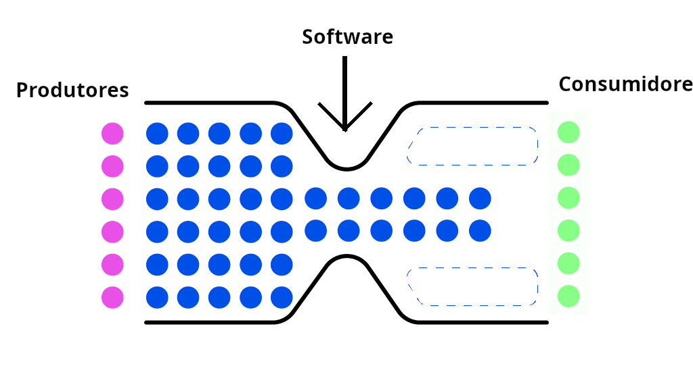

# Move Fast and Break Things
## Tecnologias Disruptivas e seus Impactos Sociais

### Introdução: Disrupção, Monopólios e Gargalos

#### Software e Rentismo (opcional)

O software é um conjunto de instruções para um determinado processador de computador, geralmente armazenado em memória digital na forma executável, acessível apenas através de uma máquina ou interface. 
Como o software não pode "trabalhar" por si só, apenas ser executado por um processador (digital, analógico ou humano), ele é inerentemente incapaz de efetivar alguma mudança no mundo material por si só.
Ao invés disso, o software pode apenas operar dentro dos limites da memória do computador que o executa, gerenciando e manipulando memória. Para poder efetivar alguma mudança para além desses limites, ele precisa de alguma outra ferramenta que efetive a mudança, seja humana ou hardware.

Por outro lado o software é infinitamente replicável e distribuível, principalmente nos tempos da World-Wide Web. Ele também é interpretado legalmente como propriedade, tendo por padrão direitos autorais e podendo ser patenteado.
Isso significa que o software pode ter um alcance de mercado que é impossível para commodities ou propriedade material, com custos de distribuição e operação muito baixos (em particular, em alguns casos o custo de operação do software pode ser terceirizado para os aparelhos dos próprios consumidores), mas qualquer atuação material do software se torna muito cara pelo aspecto humano ou mecanico.

Isso é relevante porque, como veremos, a maioria das "Big Techs," ou seja grandes empresas da área de Tecnologia (da Informação) detêm poder ecônomico (e político) gigantesco, mas esse poder não vem da produção de um "produto" para ser consumido ou mesmo do seu tamanho em número de funcinários. Ele vêm apenas do fato que eles já são os donos de alguma propriedade (Meta, Alphabet, Microsoft), com a qual outras empresas menores produzem (Cloud, Azure, Aws) ou redistribuem (YouTube, Google, Amazon, Instagram) os seus produtos.

O ato de derivar renda apenas do ato de ser dono de uma propriedade, sem produção social, é chamado "rentismo," com o exemplo clássico de aluguel imobiliário.

#### Tecnologias Disruptivas, Mafia do PayPal e o Capitalismo de Finanças

Os fundadores das empresas X.com (Elon Musk) e Confinity (Peter Thiel), que juntas se tornaram hoje o PayPal (subsidiária do eBay) ambos de origens ricas na Africa do Sul no regime de Apartheid, são uma peça central do que hoje é chamada da "PayPal Mafia," um grupo informal que inclui os antigos criadores do PayPal que ficaram ricos com o sucesso do primeiro projeto, e agora se apoiam com venture capital nos seus projetos do Vale do Silício.
Para alguns exemplos, estão inclusos nesse grupo os 3 co-fundadores do YouTube, 2 do Yelp, 1 dos co-fundadores do Linkedin e alguns futuros executivos do Facebook, além de vários donos de Venture Capitals. Outras empresas também foram co-fundadas  ou financiadas pelos 2 previamente citados, como OpenAI, Boring Company, Tesla, SpaceX, Palantir e YCombinator.

Peter Thiel, considerado o "líder" do grupo, escreveu [um livro](Zero to One) no qual ele descreve uma ["Fórmula de Sucesso"](https://archive.is/6liJO) para empresas que queiram seguir o seu sucesso. Essa formula toma como premissa de que o capitalismo e a democracia e livre mercado são inerentemente incompatíveis, e que o objetivo de todo empreendedor é construir um monopólio. De forma crítica, os 4 passos dessa fórmula podem ser resumidas da seguinte forma:

1. Construa software proprietário que seja 10 vezes "melhor" que a competição.
    * A essência dessa regra é a parte do software proprietário. Para poder criar um sistema rentista, e manter os custos operacionais da empresa os menores possíveis, é necessário ter uma vantagem em relação a competição com sigilo e leis de direitos autorais de software. Caso o "produto" criado seja software livre, ele pode ser escalado, melhorado ou copiado fora do controle da corporação, dando o poder aos consumidores ou produtores que deveria ser da empresa. A parte de "10 vezes melhor" não é uma definição objetiva, mas para efeitos dessa análise será entendido como "conveniente."
    * Um bom exemplo disso é como o sistema de busca Google no princípio tinha uma performance melhor que a sua competição por aplicar um método fortemente inspirado no RankDex, cujo autor Li Yanhong [acusa a Google](https://www.rankdex.com/) de ter sido piorado intencionalmente para poder criar a sua propria patente.

2. Busque "Network Effects," ou produtos cujo valor escala de forma superlinear em relação ao número de usuários.
    * Como o seu objetivo é construir um monopólio (e qualquer monopólio serve), o objetivo da sua empresa deve ser dedicado a serviços que vão ter um maior valor para usuários de acordo com o número de usuários que já estão na plataforma. Isso tem um efeito duplo. 
    * No caso do sucesso do monopólio empresas competidoras estarão em desvantagem para suplantar o monopólio, mesmo com um produto superior.
    * Como o objetivo é atacar mercados desorganizados como redes sociais ou entregas por aplicativo, o foco de grandes investimentos (com apoio de Venture Capitals como os fundados pela PayPal Mafia) será uma vantagem significativa inicial contra tanto empresas estabelecidas e desorganizadas, quanto contra futuros copycats.

3. Cria uma "Economia de Escala," onde a sua empresa terá uma vantagem operacional pelo seu próprio tamanho.
    * Intuitivamente, uma redução do custo "por operação" de uma empresa tem sinergia com a valorização combinatória em relação ao tamanho da sua audiência. 
    * Para o caso de software, como o custo da computação local é terceirizada para o usuário, e o custo de computação em larga escala é altamente escalável com inovações como computação na nuvem e Kubernetes, essa regra se aplica comumente para empreendimentos de software.

4. Construa uma boa marca.
    * Um dos métodos mais intuitivos para identificar um monopólio é o quão difícil é separar a marca do seu mercado. Uma pessoa faz a barba com uma Gilette®, faz uma pesquisa no Google®, assiste videos no YouTube®, conversa com amigos no WhatsApp®, e pede comida pelo iFood®. Até o ato de filosofar sobre um possível competidor que tome o mercado de "iFood" pode se tornar um exercício em doublespeak.
    * Além disso, é muito importante normalizar a ideia da benevolência do monopólio para a população cativa. O lema "Don't be evil" da Google representa bem a atitude que deve ser incentivada, onde o controle completo de uma porção da economia por um grupo seleto de empreendores é visto como "aceitável" por todos os benefícios que esse controle traz, como os smartphones Android.

Em linhas gerais essa formula também implicitamente depende da atuação de Venture Capitals. Nenhuma empresa é criada já tendo posse de economias de escala ou bases de usuários grandes. Ao invés disso, são sempre necessários anos de operação em déficit e rodadas de investimentos na esperança de conseguir capturar e consolidar esse mercado. Esse processo de disrupção, captura (e a guerra contra copycats) e finalmente o monopólio onde os lucros são extraídos será explorada em detalhes.

A observação de que o capitalismo é incompatível com livre mercado e competição pode parecer contraditória, mas na verdade tem um passado marxista. O autor Vladimir Ulianov, em seu livro clássico ["Imperialismo: Fase Superior do Capitalismo"](https://www.marxists.org/portugues/lenin/1916/imperialismo/index.htm) em 1916 define o capitalismo como tendo duas fases, antes e depois da Primeira Guerra Mundial, o capitalismo do "livre mercado" e o capitalismo "imperialista," "de finanças," ou
mmonopolista.
Nessa segunda fase, o poder econômico dos bancos e capital de finanças (hoje chamados de Venture Capital) suplanta as forças de consumo de luta dos produtores. Com o uso de grandes investimentos de outras áreas da economia já monopolizadas, empresas com perspectivas monopolistas como a Uber podem [operar anos no prejuízo](https://www.bbc.com/portuguese/geral-49858418) na perspectiva de consolidar mais um mercado com práticas anti-competitivas, como ["Price
Fixing"](https://en.wikipedia.org/wiki/Price_fixing) onde os preços são artificialmente reduzidos no prejuízo até a competição menor ser consolidada ou eliminada.

Como corporações monopolistas tem interesses diametricamente opostos aos seus competidores menores, mas iguais entre si, elas comumente formam carteis onde um pequeno número de corporações detêm toda a aparente competição em um mercado na forma de subsidiárias. Por exemplo, emboara a Alphabet e Microsoft sejam nominalmente competidoras no mercado de navegadores da web, o navegador Edge hoje é apenas uma versão customisada do Chromium, que é base do Google Chrome e controlado pela
Alphabet. Dessa forma, ambas as empresas controlam [mais de 75%](https://gs.statcounter.com/browser-market-share/desktop/worldwide/#monthly-202110-202110-bar) do mercado de navegadores para desktop. A escolha de cooperação com a Alphabet e não Mozilla pode parecer contra-intuitiva, mas uma cooperação entre coorporações monopolistas é beneficial tanto para os executivos (que não possuem lealdade à marca e frequentemente mudam de empresas), mas também porque competidores em software livre são tóxicos para esse tipo de consolidação.

Cooperando entre si, ambas empresas podem adotar práticas anti-competitivas como a [Web Environment Integrity API](https://arstechnica.com/gadgets/2023/07/googles-web-integrity-api-sounds-like-drm-for-the-web/) ou a depreciação de funções usadas por adBlockers (a fonte primária de renda da Google é propagandas) e outras extensões bloqueadoras de conteúdo no [Manifest
V3](https://www.theverge.com/2022/6/10/23131029/mozilla-ad-blocking-firefox-google-chrome-privacy-manifest-v3-web-request).

#### Gargalos

Como software não possui nenhum potencial produtivo por si só, empresas monopolistas proprietárias de software precisam controlar a cadeia produtiva de outra forma. A forma encontrada pelas Big Techs se baseia em uma estrutura que mistura um monopólio (apenas um **vendedor** de um recurso) com um monopsônio (apenas um **comprador** de um recurso). Sendo o unico (ou o maior, pelo network effect) espaço na web onde um vendedor e um comprador podem se encontrar para realizar a troca do
produto, a corporação pode extrar "mais-valia" [\(surplus value\)](https://en.wikipedia.org/wiki/Surplus_value) de ambos os lados da cadeia. Esse efeito é chamado pelo autor Cory Doctorow de "Gargalo" (Chokepoint), por criar uma aparente escarcidade para produtores e consumidores de forma artificial, de forma semelhante a como um gargalo em um sistema computacional pode limitar o uso dos recursos de um sistema teoricamente mais potente, causando uma performance pior que a esperada.

Um dos melhores exemplos de um gargalo produtivo é a Amazon.

#### Disk Cook, e os Cardápios Digitais

Essa teoria será aplicada para a empresa de Cardápios Digitais (chamada também de "Entregas por Aplicativo") iFood (subsidiária da empresa Movile), que [alguns autores](https://latamlist.com/the-history-behind-the-movile-mafia-latin-americas-biggest-startup-group/) definem como a origem  de uma "Movile Mafia," semelhante à PayPal Mafia.

