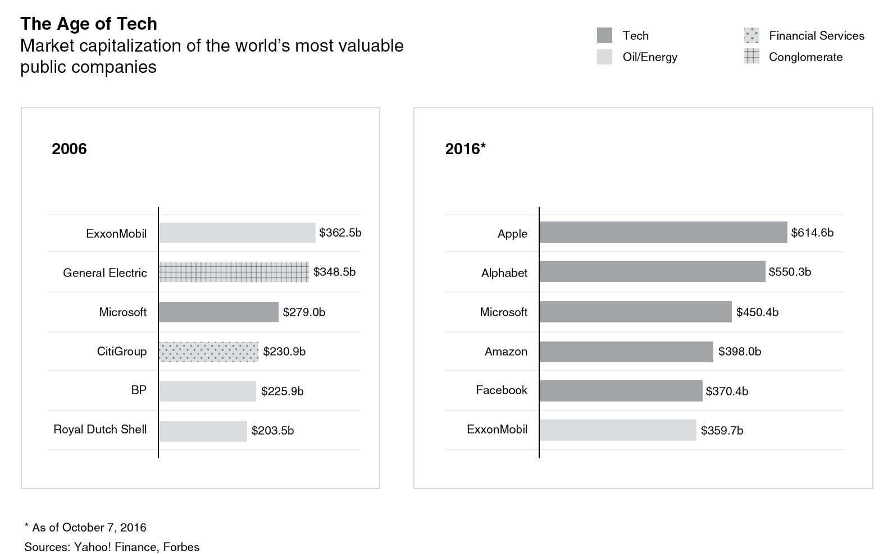

# Move Fast and Break Things

## Introdução

Nesse livro, o autor descreve e desmistifica as práticas intencionais e elaboradas de "Empreendedores da Internet," em parceria com Venture Capital, de forma a utilizar "disrupção" e falhas regulatórias para consolidação de monopolios. O livro trás o histórico "anarco-capitalista" e reacionário dos criadores dessas corporações, e suas parcerias com hedge funds e investidores para identificar, *disrupt* e consolidar mercados pouco competitivos, particularmente nas áreas de
destribuição de serviços. 

Além disso, ele pontua algumas das práticas anti-competitivas intencionais, como o controle dos investimentos em competidores (incluindo o serviço do próprio autor "Interteiner"), redução agressiva de preços em déficit ou sonegação fiscal, ou até ataques diretos contra leis de direitos autorais e anti-pirataria. Um ponto pouco noticiado sobre o sucesso dessas empresas e suas formações de trusts e monopolios/monopsônios é fato de que a existência e dominação delas se deve em
grande parte pelo relaxamento de políticas anti-trust estadunidenses, captura regulatória, sonegação de impostos, e imposições imperialistas.

Em particular, nenhuma das empresas listadas (Alphabet, Meta, Amazon) realmente produz algo. Ao contrário, elas se situam exatamente no centro entre produção e consumo, agindo como intermediários ( *middlemen*), e controlando todo o fluxo do produto relevante. Isso é elaborado propriamente no livro "Chokepoint Capitalism" de Rebecca Gibbin. Ele também descreve o como, devido a natureza universalizada e padronizada da internet, esses sitemas de software conseguem extender seus monopólios sem limitações por barreiras nacionais.

Existem alguns pontos controversos no livro, como por exemplo a noção de que a defesa de direitos autorais serviriam para remediar a circunstancia específica dos artistas. Como podemos ver hoje, com as greves da WGA e SAG-AFTRA contra a precarização de condições de trabalho e renda com serviços de streaming, e a ascensão do Spotify, que formou carteis com gravadoras para reduzir ao máximo possível a remuneração dos musicos mesmo que a a arte em si seja obtida de forma legal, as
corporações responsáveis serão os verdadeiros donos do dinheiro dos consumidores.

No geral, a análise pode ser fortemente aplicada para o histórico de desenvolvimento das chamadas "foodtechs" como iFood, 99food, Uber Eats, Rappi e Glovo, e o monopólio/monopsônio subsquente do iFood como única grande empresa sobrevivente dessa competição.

Com a digitização da economia, e o crescimento de monopólios/monopsonios rentistas, hoje temos umas condição onde aqueles que mais detem poder economico (e portanto poder politico) são as empresas "lean" de software que comandam as posições mais críticas da economia, mesmo com produção e forças de trabalho estagnadas:

O autor descreve a formula de Thiel para consolidar monopólios na era digital:

1. Build a proprietary technology that has significant benefits over the competition. Thiel says, “It’s always a red flag when entrepreneurs talk about getting 1% of a $100 billion market.” He wanted to invest in monopolies, not competitive businesses.

2. Build businesses that have “network effects.” Thiel’s first two major investments, PayPal and Facebook, both benefit from having millions of users who want to connect with each other. When PayPal was just a payment system for Palm Pilot, it was a failure. As soon as it became the standard payment system for eBay, it got the network-effect wind at its back.

3. Economies of scale are critical. Google is pretty much unassailable in search-engine advertising because it has huge economies of scale. This leads to the conclusion that there will be very few winners in each sector of tech. The combination of scale and network effects makes it very hard to dislodge the winners, especially if you are in a business like tech, which is so lightly regulated.

4. Branding becomes critical. The brand becomes a promise of value to consumers. Apple gets superior margins because of its brand promise for quality and elegant design. The brand promise also helps you defend yourself against government intrusion. Google’s original “Don’t be evil” brand promise gave them a patina of social entrepreneurship that helps protect them from accusations of monopoly power tactics.

O autor descreve a formula de Thiel para consolidar monopólios na era digital:

1. Build a proprietary technology that has significant benefits over the competition. Thiel says, “It’s always a red flag when entrepreneurs talk about getting 1% of a $100 billion market.” He wanted to invest in monopolies, not competitive businesses.

2. Build businesses that have “network effects.” Thiel’s first two major investments, PayPal and Facebook, both benefit from having millions of users who want to connect with each other. When PayPal was just a payment system for Palm Pilot, it was a failure. As soon as it became the standard payment system for eBay, it got the network-effect wind at its back.

3. Economies of scale are critical. Google is pretty much unassailable in search-engine advertising because it has huge economies of scale. This leads to the conclusion that there will be very few winners in each sector of tech. The combination of scale and network effects makes it very hard to dislodge the winners, especially if you are in a business like tech, which is so lightly regulated.

4. Branding becomes critical. The brand becomes a promise of value to consumers. Apple gets superior margins because of its brand promise for quality and elegant design. The brand promise also helps you defend yourself against government intrusion. Google’s original “Don’t be evil” brand promise gave them a patina of social entrepreneurship that helps protect them from accusations of monopoly power tactics.

